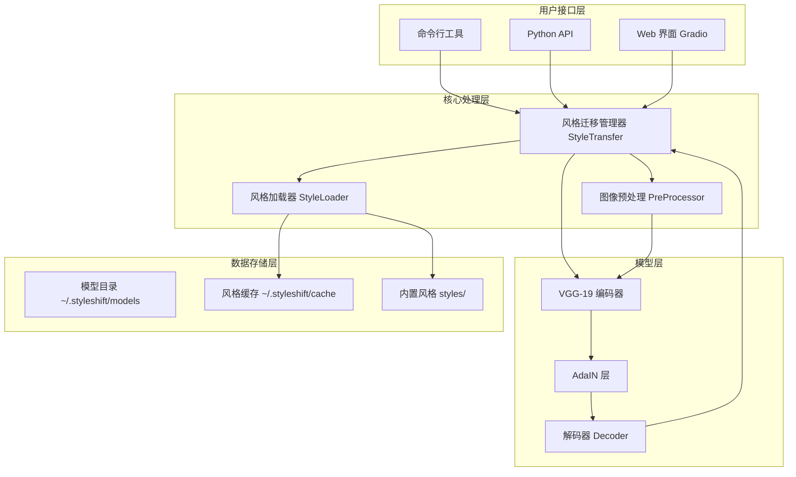
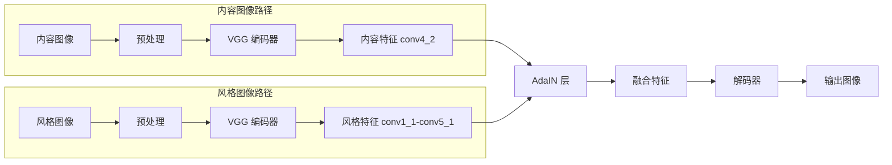
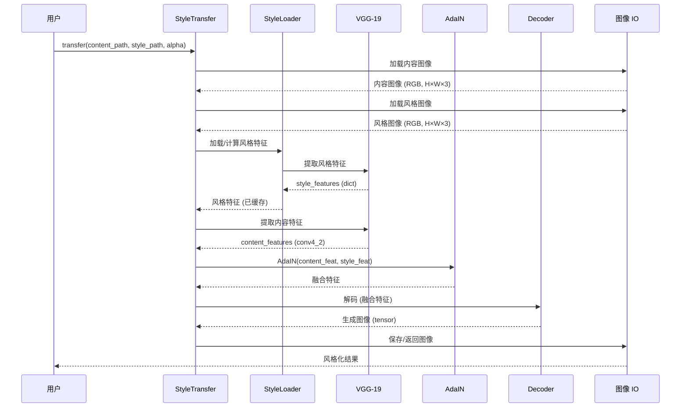
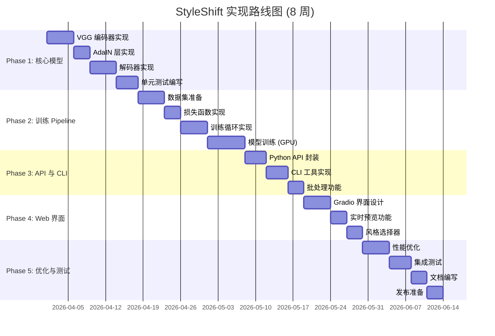
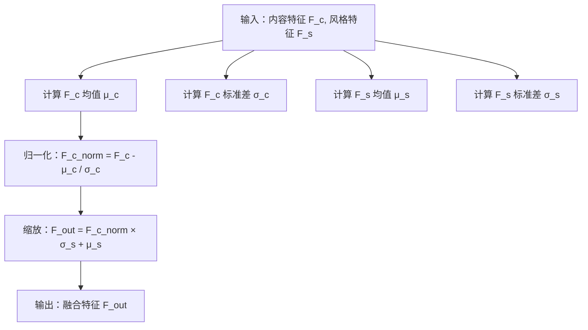
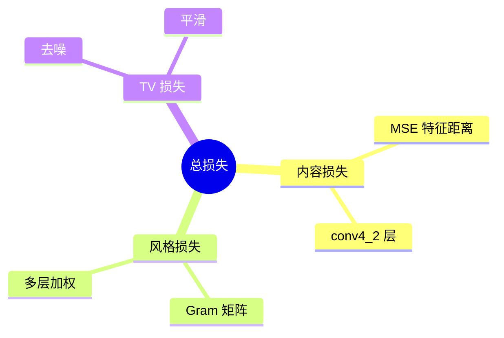

> **文档版本**: v1.0  
> **创建日期**: 2026 年 3 月 26 日  
> **最后更新**: 2026 年 3 月 26 日  
> **状态**: 📋 待实现

---

## 📑 目录

- [1. 项目概述与目标](#1-项目概述与目标)
- [2. 技术架构设计](#2-技术架构设计)
- [3. 实现路线图](#3-实现路线图)
- [4. 文件结构与目录设计](#4-文件结构与目录设计)
- [5. 核心算法实现细节](#5-核心算法实现细节)
- [6. 训练策略与数据集](#6-训练策略与数据集)
- [7. API 设计规范](#7-api-设计规范)
- [8. 依赖管理与环境配置](#8-依赖管理与环境配置)
- [9. 测试策略](#9-测试策略)
- [10. 性能优化方案](#10-性能优化方案)
- [11. 风险评估与缓解措施](#11-风险评估与缓解措施)
- [附录 A: 部署指南](#附录-a-部署指南)
- [附录 B: 贡献指南](#附录-b-贡献指南)
- [附录 C: 版本兼容性矩阵](#附录-c-版本兼容性矩阵)

---

## 1. 项目概述与目标

### 1.1 项目愿景

**StyleShift（风转）** 是一个基于深度学习的实时图像风格迁移工具，旨在让用户能够以极低的计算成本将任意照片转换为各种艺术风格。项目名称"风转"寓意为"风格的流转与转换"，体现快速、流畅的风格迁移体验。

**核心价值主张**：
- 🎨 **任意风格**：支持用户上传任意风格图像，无需针对每种风格单独训练
- ⚡ **实时推理**：单张图像风格迁移 < 1 秒（GPU），< 5 秒（CPU）
- 🖼️ **高质量输出**：保持内容结构完整性的同时，实现逼真的艺术风格化
- 🛠️ **易用性**：提供 CLI、Python API、Web 界面三种使用方式

### 1.2 核心功能

| 功能模块 | 描述 | 优先级 |
|---------|------|--------|
| 风格迁移引擎 | 基于 AdaIN 的核心算法实现 | P0 |
| 内置风格库 | 10+ 预训练风格（anime, vangogh, monet, ukiyoe 等） | P0 |
| 自定义风格 | 支持用户上传任意风格图像 | P0 |
| 命令行工具 | 完整的 CLI 接口，支持批处理 | P0 |
| Python API | 可编程接口，支持集成到其他项目 | P0 |
| Web 演示界面 | Gradio 界面，支持实时预览 | P1 |
| 模型管理 | 自动下载、缓存、版本管理 | P1 |
| 批量处理 | 支持目录级批量风格迁移 | P1 |
| 分辨率控制 | 支持输出分辨率调整 | P2 |
| 风格强度调节 | 可调节风格化程度（alpha 参数） | P2 |

### 1.3 技术选型理由

#### 为什么选择 AdaIN？

| 算法 | 推理速度 | 任意风格 | 质量 | 实现复杂度 |
|------|---------|---------|------|-----------|
| Johnson et al. (2016) | ⚡⚡⚡ | ❌ 每风格一模型 | ⭐⭐⭐⭐ | 中 |
| WCT (2017) | ⚡ | ✅ | ⭐⭐⭐ | 高 |
| **AdaIN (2017)** | ⚡⚡⚡ | ✅ | ⭐⭐⭐⭐ | **低** |
| StyleGAN (2020) | ⚡ | ❌ 需训练 | ⭐⭐⭐⭐⭐ | 极高 |

**AdaIN 优势**：
1. **推理速度快**：单次前向传播即可完成，无需迭代优化
2. **支持任意风格**：运行时指定风格图像，无需重新训练
3. **实现简单**：核心代码 < 50 行
4. **内存效率高**：无需存储 Gram 矩阵，适合资源受限环境

#### 为什么选择 VGG-19？

- ✅ **预训练权重**：ImageNet 预训练，特征表示能力强
- ✅ **层次化特征**：19 层网络提供多尺度特征提取
- ✅ **社区支持**：PyTorch 原生支持，文档丰富
- ✅ **性能稳定**：被广泛验证的风格迁移基准网络

**备选方案**：ResNet-50（更快的推理速度，但风格质量略低）

### 1.4 成功指标

**技术指标**：
- [ ] 推理延迟：< 100ms（512×512，GPU），< 2s（CPU）
- [ ] 模型大小：< 200MB（编码器 + 解码器）
- [ ] 内存占用：< 2GB（推理过程）
- [ ] 测试覆盖率：核心模块 > 80%，整体 > 70%

**用户体验指标**：
- [ ] CLI：单命令完成风格迁移
- [ ] API：3 行代码完成风格迁移
- [ ] Web：上传到出图 < 3 秒（GPU）


---

## 2. 技术架构设计

### 2.1 系统架构图



### 2.2 模型结构



**详细架构**：

```
输入 (224×224×3)
    ↓
VGG-19 编码器 (conv1_1 → conv4_2)
    ↓
内容特征 F_c (512×14×14)
    ↓
AdaIN 层 (与风格特征融合)
    ↓
融合特征 F_fused (512×14×14)
    ↓
解码器 (上采样 + 卷积)
    ↓
输出 (224×224×3)
```

### 2.3 数据流设计



### 2.4 模块划分

| 模块 | 职责 | 关键类/函数 | 依赖 |
|------|------|------------|------|
| `models/encoder.py` | VGG-19 特征提取 | `VGG19Encoder`, `get_vgg19()` | torchvision |
| `models/decoder.py` | 特征重建为图像 | `Decoder`, `ResidualBlock` | torch |
| `models/adain.py` | AdaIN 归一化 | `AdaIN`, `adain_function()` | torch |
| `models/loss.py` | 损失函数计算 | `StyleLoss`, `ContentLoss`, `TVLoss` | torch |
| `core/style_transfer.py` | 主迁移逻辑 | `StyleTransfer` | 全部模型模块 |
| `utils/image_io.py` | 图像加载/保存 | `load_image()`, `save_image()` | PIL, numpy |
| `utils/style_loader.py` | 风格管理 | `StyleLoader`, `download_builtin_styles()` | requests |
| `cli/main.py` | 命令行接口 | `parse_args()`, `main()` | argparse |
| `app.py` | Web 界面 | Gradio interface | gradio |


---

## 3. 实现路线图

### 3.1 总体时间线



### 3.2 Phase 1: 核心模型实现 (Week 1-2)

**时间**：2026-04-01 ~ 2026-04-17  
**目标**：完成模型定义 + 单元测试

#### 交付物

| 文件 | 描述 | 验收标准 |
|------|------|---------|
| `models/vgg.py` | VGG-19 编码器 | 通过单元测试，输出特征维度正确 |
| `models/adain.py` | AdaIN 层 | 数学公式验证通过，梯度正确 |
| `models/decoder.py` | 解码器 | 能从 AdaIN 输出重建图像 |
| `models/__init__.py` | 模块导出 | 可从 `models` 导入所有类 |
| `tests/test_models.py` | 模型测试 | pytest 通过率 100% |

#### 验收标准

```bash
# 运行测试
pytest tests/test_models.py -v

# 预期输出
test_vgg_encoder_output_dims ... PASSED
test_adain_formula ... PASSED
test_decoder_reconstruction ... PASSED
test_full_pipeline ... PASSED
```

### 3.3 Phase 2: 训练 Pipeline (Week 3-4)

**时间**：2026-04-18 ~ 2026-05-07  
**目标**：完成训练代码 + 预训练模型

#### 交付物

| 文件 | 描述 | 验收标准 |
|------|------|---------|
| `models/loss.py` | 损失函数 | Content/Style/TV Loss 实现 |
| `train/trainer.py` | 训练循环 | 支持 checkpoint、resume |
| `train/dataset.py` | DataLoader | MS-COCO + WikiArt 加载 |
| `configs/train_config.yaml` | 训练配置 | 超参数集中管理 |
| `scripts/train.sh` | 训练脚本 | 单命令启动训练 |
| `checkpoints/` | 预训练权重 | 10+ 内置风格模型 |

#### 验收标准

- [ ] 训练 loss 收敛曲线正常
- [ ] 生成图像质量达到 README 示例水平
- [ ] 支持中断后 resume 训练
- [ ] TensorBoard 可视化正常

### 3.4 Phase 3: API 与 CLI (Week 5)

**时间**：2026-05-08 ~ 2026-05-18  
**目标**：完成用户接口

#### 交付物

| 文件 | 描述 | 验收标准 |
|------|------|---------|
| `core/style_transfer.py` | 主 API | `StyleTransfer` 类完整 |
| `cli/main.py` | CLI 工具 | 支持所有参数 |
| `cli/__init__.py` | CLI 导出 | `python -m style_shift` 可用 |
| `examples/` | 使用示例 | 5+ 示例脚本 |

#### 验收标准

```bash
# CLI 测试
python style_shift.py --content test.jpg --style anime.jpg --output out.jpg
# 应成功生成输出图像

# API 测试
python examples/basic_usage.py
# 应无错误执行
```

### 3.5 Phase 4: Web 界面 (Week 6)

**时间**：2026-05-19 ~ 2026-05-29  
**目标**：完成 Gradio Web 应用

#### 交付物

| 文件 | 描述 | 验收标准 |
|------|------|---------|
| `app.py` | Gradio 应用 | 可运行，端口 7860 |
| `web/components/` | 自定义组件 | 风格选择器、预览组件 |
| `web/static/` | 静态资源 | CSS、示例图片 |

#### 验收标准

- [ ] 上传图像后 < 3 秒显示结果（GPU）
- [ ] 风格选择器支持 10+ 内置风格
- [ ] 支持自定义风格上传
- [ ] 移动端适配正常

### 3.6 Phase 5: 优化与测试 (Week 7-8)

**时间**：2026-05-30 ~ 2026-06-14  
**目标**：性能优化 + 完整测试 + 发布准备

#### 交付物

| 文件 | 描述 | 验收标准 |
|------|------|---------|
| `tests/test_*.py` | 完整测试套件 | 覆盖率 > 70% |
| `.github/workflows/ci.yml` | CI/CD | GitHub Actions 通过 |
| `docker/Dockerfile` | Docker 镜像 | 可构建、可运行 |
| `docs/` | 完整文档 | 本文件 + API 文档 |
| `pyproject.toml` | 包配置 | 支持 `pip install .` |

#### 验收标准

```bash
# 测试覆盖率
pytest --cov=style_shift --cov-report=html
# 覆盖率报告：> 70%

# CI/CD
git push origin main
# GitHub Actions 全部通过

# Docker
docker build -t styleshift .
docker run -p 7860:7860 styleshift
# Web 界面可访问
```


---

## 4. 文件结构与目录设计

### 4.1 完整目录树

```
StyleShift/
├── 📁 style_shift/              # 主包目录
│   ├── __init__.py              # 包初始化，导出 StyleTransfer
│   ├── core/
│   │   ├── __init__.py
│   │   └── style_transfer.py    # 核心 StyleTransfer 类
│   ├── models/
│   │   ├── __init__.py
│   │   ├── vgg.py               # VGG-19 编码器
│   │   ├── adain.py             # AdaIN 层
│   │   ├── decoder.py           # 解码器
│   │   └── loss.py              # 损失函数
│   ├── utils/
│   │   ├── __init__.py
│   │   ├── image_io.py          # 图像加载/保存
│   │   └── style_loader.py      # 风格管理
│   └── cli/
│       ├── __init__.py
│       └── main.py              # CLI 入口
│
├── 📁 train/                    # 训练相关
│   ├── __init__.py
│   ├── trainer.py               # 训练循环
│   └── dataset.py               # DataLoader
│
├── 📁 tests/                    # 测试套件
│   ├── __init__.py
│   ├── conftest.py              # pytest fixtures
│   ├── test_models.py           # 模型测试
│   ├── test_adain.py            # AdaIN 测试
│   ├── test_loss.py             # 损失函数测试
│   ├── test_style_transfer.py   # 集成测试
│   └── test_cli.py              # CLI 测试
│
├── 📁 configs/                  # 配置文件
│   ├── train_config.yaml        # 训练配置
│   └── default_config.yaml      # 默认配置
│
├── 📁 scripts/                  # 辅助脚本
│   ├── download_models.py       # 模型下载
│   ├── download_datasets.py     # 数据集下载
│   └── train.sh                 # 训练脚本
│
├── 📁 styles/                   # 内置风格图像
│   ├── anime.jpg
│   ├── vangogh.jpg
│   ├── monet.jpg
│   └── ...
│
├── 📁 examples/                 # 使用示例
│   ├── basic_usage.py
│   ├── batch_processing.py
│   └── custom_style.py
│
├── 📁 checkpoints/              # 预训练模型 (gitignore)
│   ├── decoder_anime.pth
│   ├── decoder_vangogh.pth
│   └── ...
│
├── 📁 docker/                   # Docker 配置
│   └── Dockerfile
│
├── .github/
│   └── workflows/
│       └── ci.yml               # CI/CD 配置
│
├── style_shift.py               # CLI 快捷入口
├── app.py                       # Gradio Web 应用
├── requirements.txt             # Python 依赖
├── requirements-dev.txt         # 开发依赖 (测试等)
├── pyproject.toml              # 包配置
├── setup.py                     # 安装脚本 (兼容)
├── README.md                    # 项目说明
├── LICENSE                      # 许可证
├── .gitignore                   # Git 忽略规则
└── .pre-commit-config.yaml      # pre-commit hooks
```

### 4.2 关键文件说明

#### `style_shift/__init__.py`
```python
"""StyleShift - 神经风格迁移工具包"""

__version__ = "0.1.0"
__author__ = "StyleShift Team"

from .core.style_transfer import StyleTransfer
from .models.adain import AdaIN
from .models.vgg import VGG19Encoder

__all__ = ["StyleTransfer", "AdaIN", "VGG19Encoder"]
```

#### `style_shift/core/style_transfer.py`
```python
"""核心风格迁移类 - StyleTransfer"""

import torch
from pathlib import Path
from typing import Union, Optional

from ..models.vgg import VGG19Encoder
from ..models.adain import AdaIN
from ..models.decoder import Decoder
from ..utils.image_io import load_image, save_image
from ..utils.style_loader import StyleLoader


class StyleTransfer:
    """
    风格迁移主类
    
    示例用法:
        st = StyleTransfer()
        result = st.transfer("content.jpg", "style.jpg")
    """
    
    def __init__(
        self,
        device: Optional[str] = None,
        model_dir: str = "~/.styleshift/models",
        cache_dir: str = "~/.styleshift/cache"
    ):
        """
        初始化风格迁移器
        
        Args:
            device: 计算设备 ('cuda' 或 'cpu')，默认自动选择
            model_dir: 模型存储目录
            cache_dir: 风格特征缓存目录
        """
        # 自动选择设备
        if device is None:
            self.device = "cuda" if torch.cuda.is_available() else "cpu"
        else:
            self.device = device
        
        self.model_dir = Path(model_dir).expanduser()
        self.cache_dir = Path(cache_dir).expanduser()
        
        # 初始化组件
        self.encoder = VGG19Encoder().to(self.device)
        self.adain = AdaIN().to(self.device)
        self.decoder = Decoder().to(self.device)
        self.style_loader = StyleLoader(self.cache_dir)
        
        # 加载预训练权重
        self._load_pretrained_models()
```


---

## 5. 核心算法实现细节

### 5.1 AdaIN (Adaptive Instance Normalization)

#### 5.1.1 数学原理

AdaIN 的核心思想是将内容特征归一化后，用风格特征的统计量进行重新缩放和平移。

**公式**：

$$\text{AdaIN}(x, y) = \sigma(y) \left( \frac{x - \mu(x)}{\sigma(x)} \right) + \mu(y)$$

其中：
- $x$: 内容特征图 (content features)
- $y$: 风格特征图 (style features)
- $\mu(x)$: 内容特征的通道均值
- $\sigma(x)$: 内容特征的通道标准差
- $\mu(y)$: 风格特征的通道均值
- $\sigma(y)$: 风格特征的通道标准差

**计算步骤**：



#### 5.1.2 完整实现代码

```python
# style_shift/models/adain.py
"""AdaIN (Adaptive Instance Normalization) 实现"""

import torch
import torch.nn as nn


class AdaIN(nn.Module):
    """
    自适应实例归一化层
    
    将内容特征的统计量对齐到风格特征的统计量
    
    输入形状：
        - content: (batch, channel, height, width)
        - style: (batch, channel, height, width)
    输出形状：
        - output: (batch, channel, height, width)
    """
    
    def __init__(self, eps: float = 1e-5):
        """
        Args:
            eps: 数值稳定性参数，防止除零
        """
        super().__init__()
        self.eps = eps
    
    def forward(
        self,
        content: torch.Tensor,
        style: torch.Tensor
    ) -> torch.Tensor:
        """
        执行 AdaIN 操作
        
        Args:
            content: 内容特征图
            style: 风格特征图
            
        Returns:
            融合后的特征图
        """
        # 计算内容特征的均值和标准差
        content_mean, content_std = self._calc_mean_std(content)
        
        # 计算风格特征的均值和标准差
        style_mean, style_std = self._calc_mean_std(style)
        
        # 归一化内容特征
        normalized_content = (content - content_mean) / content_std
        
        # 用风格统计量重新缩放和平移
        output = style_std * normalized_content + style_mean
        
        return output
    
    def _calc_mean_std(
        self,
        feat: torch.Tensor
    ) -> tuple[torch.Tensor, torch.Tensor]:
        """
        计算特征图的通道均值和标准差
        
        Args:
            feat: 特征图 (batch, channel, height, width)
            
        Returns:
            (mean, std): 均值和标准差，形状均为 (batch, channel, 1, 1)
        """
        batch_size, channels = feat.shape[:2]
        
        # 重塑为 (batch, channel, height*width) 便于计算
        feat_reshaped = feat.reshape(batch_size, channels, -1)
        
        # 计算均值：对空间维度求平均
        mean = feat_reshaped.mean(dim=2, keepdim=True)
        
        # 计算方差：对空间维度求方差
        var = feat_reshaped.var(dim=2, keepdim=True)
        
        # 计算标准差，加 eps 防止除零
        std = torch.sqrt(var + self.eps)
        
        # 重塑回 (batch, channel, 1, 1) 以便广播
        mean = mean.reshape(batch_size, channels, 1, 1)
        std = std.reshape(batch_size, channels, 1, 1)
        
        return mean, std


def adain_function(
    content: torch.Tensor,
    style: torch.Tensor,
    eps: float = 1e-5
) -> torch.Tensor:
    """
    AdaIN 函数式接口（无需实例化类）
    
    Args:
        content: 内容特征
        style: 风格特征
        eps: 数值稳定性参数
        
    Returns:
        融合特征
    """
    # 计算统计量
    content_mean = content.mean(dim=(2, 3), keepdim=True)
    content_std = content.std(dim=(2, 3), keepdim=True, unbiased=False)
    
    style_mean = style.mean(dim=(2, 3), keepdim=True)
    style_std = style.std(dim=(2, 3), keepdim=True, unbiased=False)
    
    # AdaIN 变换
    normalized = (content - content_mean) / (content_std + eps)
    output = style_std * normalized + style_mean
    
    return output
```

#### 5.1.3 使用示例

```python
import torch
from style_shift.models.adain import AdaIN, adain_function

# 创建示例数据
batch_size = 2
channels = 512
height, width = 14, 14

content_features = torch.randn(batch_size, channels, height, width)
style_features = torch.randn(batch_size, channels, height, width)

# 方法 1: 使用类
adain_layer = AdaIN()
output1 = adain_layer(content_features, style_features)

# 方法 2: 使用函数
output2 = adain_function(content_features, style_features)

print(f"输入形状：{content_features.shape}")
print(f"输出形状：{output1.shape}")
# 输出形状：torch.Size([2, 512, 14, 14])
```

### 5.2 VGG-19 特征提取器

#### 5.2.1 网络结构

```mermaid
graph LR
    subgraph "VGG-19 编码器"
        I[输入图像 224×224×3]
        
        subgraph "conv1"
            C1_1[conv1_1 64]
            C1_2[conv1_2 64]
            R1_1[relu]
            P1[maxpool]
        end
        
        subgraph "conv2"
            C2_1[conv2_1 128]
            C2_2[conv2_2 128]
            R2_1[relu]
            P2[maxpool]
        end
        
        subgraph "conv3"
            C3_1[conv3_1 256]
            C3_2[conv3_2 256]
            C3_3[conv3_3 256]
            C3_4[conv3_4 256]
            R3_1[relu]
            P3[maxpool]
        end
        
        subgraph "conv4"
            C4_1[conv4_1 512]
            C4_2[conv4_2 512 ★内容]
            C4_3[conv4_3 512]
            C4_4[conv4_4 512]
            R4_1[relu]
            P4[maxpool]
        end
        
        subgraph "conv5"
            C5_1[conv5_1 512 ★风格]
            C5_2[conv5_2 512]
            C5_3[conv5_3 512]
            C5_4[conv5_4 512]
            R5_1[relu]
            P5[maxpool]
        end
    end
    
    I --> C1_1
    C1_1 --> C1_2 --> R1_1 --> P1
    P1 --> C2_1 --> C2_2 --> R2_1 --> P2
    P2 --> C3_1 --> C3_2 --> C3_3 --> C3_4 --> R3_1 --> P3
    P3 --> C4_1 --> C4_2 --> C4_3 --> C4_4 --> R4_1 --> P4
    P4 --> C5_1 --> C5_2 --> C5_3 --> C5_4 --> R5_1 --> P5
    
    style C4_2 -.-> S1[内容特征]
    style C1_1 -.-> S2[风格特征]
    style C2_1 -.-> S2
    style C3_1 -.-> S2
    style C4_1 -.-> S2
    style C5_1 -.-> S2
```

#### 5.2.2 层选择策略

| 用途 | 层名 | 输出尺寸 | 通道数 | 说明 |
|------|------|---------|--------|------|
| **内容特征** | `conv4_2` | 14×14 | 512 | 高层语义信息，保留内容结构 |
| **风格特征** | `conv1_1` | 224×224 | 64 | 细粒度纹理 |
| | `conv2_1` | 112×112 | 128 | 中等纹理 |
| | `conv3_1` | 56×56 | 256 | 复杂图案 |
| | `conv4_1` | 28×28 | 512 | 风格结构 |
| | `conv5_1` | 14×14 | 512 | 全局风格 |

#### 5.2.3 完整实现代码

```python
# style_shift/models/vgg.py
"""VGG-19 编码器实现"""

import torch
import torch.nn as nn
from torchvision import models
from typing import Dict, List, OrderedDict


# 内容特征层和风格特征层
CONTENT_LAYERS = ["conv4_2"]
STYLE_LAYERS = ["conv1_1", "conv2_1", "conv3_1", "conv4_1", "conv5_1"]

# VGG 层名映射（从索引到名称）
VGG_LAYER_NAMES = {
    0: "conv1_1",
    2: "conv1_2",
    5: "conv2_1",
    7: "conv2_2",
    10: "conv3_1",
    12: "conv3_2",
    14: "conv3_3",
    16: "conv3_4",
    19: "conv4_1",
    21: "conv4_2",
    23: "conv4_3",
    25: "conv4_4",
    28: "conv5_1",
    30: "conv5_2",
    32: "conv5_3",
    34: "conv5_4",
}


class VGG19Encoder(nn.Module):
    """
    VGG-19 特征提取器
    
    使用 ImageNet 预训练的 VGG-19 作为编码器
    提取指定层的特征用于风格迁移
    
    示例:
        encoder = VGG19Encoder()
        features = encoder.extract_features(image)
        content_feat = features["conv4_2"]
        style_feats = {k: features[k] for k in STYLE_LAYERS}
    """
    
    def __init__(
        self,
        content_layers: List[str] = CONTENT_LAYERS,
        style_layers: List[str] = STYLE_LAYERS,
        pretrained: bool = True
    ):
        """
        Args:
            content_layers: 用于内容损失的层名列表
            style_layers: 用于风格损失的层名列表
            pretrained: 是否加载 ImageNet 预训练权重
        """
        super().__init__()
        
        self.content_layers = content_layers
        self.style_layers = style_layers
        self.all_layers = list(set(content_layers + style_layers))
        
        # 加载预训练的 VGG-19
        vgg19 = models.vgg19(weights=models.VGG19_Weights.IMAGENET1K_V1 if pretrained else None)
        
        # 只保留卷积层（去掉全连接层和分类层）
        self.conv_layers = vgg19.features[:35]  # 到 conv5_4
        
        # 注册 hooks 来捕获中间层输出
        self._layer_outputs: Dict[str, torch.Tensor] = {}
        self._register_hooks()
        
        # 冻结参数（不需要梯度）
        self._freeze_parameters()
    
    def _register_hooks(self):
        """为需要的层注册 forward hook"""
        for idx, layer in enumerate(self.conv_layers):
            if idx in VGG_LAYER_NAMES:
                layer_name = VGG_LAYER_NAMES[idx]
                if layer_name in self.all_layers:
                    layer.register_forward_hook(self._make_hook(layer_name))
    
    def _make_hook(self, layer_name: str):
        """创建 hook 函数"""
        def hook(module, input, output):
            self._layer_outputs[layer_name] = output
        return hook
    
    def _freeze_parameters(self):
        """冻结所有参数，只需前向传播"""
        for param in self.parameters():
            param.requires_grad = False
    
    def forward(
        self,
        x: torch.Tensor
    ) -> Dict[str, torch.Tensor]:
        """
        提取特征
        
        Args:
            x: 输入图像 (batch, 3, height, width)
            
        Returns:
            字典，键为层名，值为特征图
        """
        # 清空之前的输出
        self._layer_outputs.clear()
        
        # 前向传播
        self.conv_layers(x)
        
        # 返回需要的层
        return {
            name: self._layer_outputs[name]
            for name in self.all_layers
            if name in self._layer_outputs
        }
    
    def extract_content_features(
        self,
        x: torch.Tensor
    ) -> torch.Tensor:
        """
        提取内容特征
        
        Args:
            x: 输入图像
            
        Returns:
            内容特征 (通常是 conv4_2)
        """
        features = self(x)
        return features[self.content_layers[0]]
    
    def extract_style_features(
        self,
        x: torch.Tensor
    ) -> Dict[str, torch.Tensor]:
        """
        提取风格特征
        
        Args:
            x: 输入图像
            
        Returns:
            风格特征字典
        """
        features = self(x)
        return {name: features[name] for name in self.style_layers}


def get_vgg19(
    content_layers: List[str] = CONTENT_LAYERS,
    style_layers: List[str] = STYLE_LAYERS
) -> VGG19Encoder:
    """
    获取 VGG-19 编码器的工厂函数
    
    Args:
        content_layers: 内容层列表
        style_layers: 风格层列表
        
    Returns:
        VGG19Encoder 实例
    """
    return VGG19Encoder(
        content_layers=content_layers,
        style_layers=style_layers,
        pretrained=True
    )
```

        

### 5.3 损失函数

#### 5.3.1 损失函数总览



**总损失公式**：

$$L_{\text{total}} = \alpha \cdot L_{\text{content}} + \beta \cdot L_{\text{style}} + \gamma \cdot L_{\text{TV}}$$

推荐超参数：
- $\alpha$ (content_weight): 1.0
- $\beta$ (style_weight): 1e6
- $\gamma$ (tv_weight): 1e-5

#### 5.3.2 内容损失 (Content Loss)

```python
# style_shift/models/loss.py
"""损失函数实现"""

import torch
import torch.nn as nn
from typing import Dict, List


class ContentLoss(nn.Module):
    """
    内容损失
    
    计算生成图像与内容图像在特征空间的 MSE 距离
    """
    
    def __init__(self, weight: float = 1.0):
        super().__init__()
        self.weight = weight
        self.mse_loss = nn.MSELoss()
    
    def forward(
        self,
        generated_features: Dict[str, torch.Tensor],
        content_features: Dict[str, torch.Tensor]
    ) -> torch.Tensor:
        """计算内容损失"""
        loss = 0.0
        num_layers = 0
        
        for layer_name in content_features.keys():
            if layer_name in generated_features:
                gen_feat = generated_features[layer_name]
                cont_feat = content_features[layer_name]
                loss += self.mse_loss(gen_feat, cont_feat)
                num_layers += 1
        
        if num_layers > 0:
            loss = loss / num_layers
        
        return loss * self.weight
```

#### 5.3.3 风格损失 (Style Loss)

```python
# style_shift/models/loss.py (续)


def gram_matrix(feat: torch.Tensor) -> torch.Tensor:
    """
    计算 Gram 矩阵
    
    Args:
        feat: 特征图 (batch, channel, height, width)
        
    Returns:
        Gram 矩阵 (batch, channel, channel)
    """
    batch_size, channels, height, width = feat.size()
    feat_reshaped = feat.reshape(batch_size, channels, -1)
    gram = torch.bmm(feat_reshaped, feat_reshaped.transpose(1, 2))
    gram = gram / (channels * height * width)
    return gram


class StyleLoss(nn.Module):
    """
    风格损失
    
    使用 Gram 矩阵计算风格特征的差异
    """
    
    def __init__(
        self,
        weight: float = 1e6,
        style_layer_weights: Dict[str, float] = None
    ):
        super().__init__()
        self.weight = weight
        self.mse_loss = nn.MSELoss()
        
        # 默认权重：浅层权重更高（捕获更多纹理细节）
        self.style_layer_weights = style_layer_weights or {
            "conv1_1": 1.0,
            "conv2_1": 0.8,
            "conv3_1": 0.6,
            "conv4_1": 0.4,
            "conv5_1": 0.2,
        }
    
    def forward(
        self,
        generated_features: Dict[str, torch.Tensor],
        style_features: Dict[str, torch.Tensor]
    ) -> torch.Tensor:
        """计算风格损失"""
        loss = 0.0
        
        for layer_name, layer_weight in self.style_layer_weights.items():
            if layer_name in generated_features and layer_name in style_features:
                gen_gram = gram_matrix(generated_features[layer_name])
                style_gram = gram_matrix(style_features[layer_name])
                loss += layer_weight * self.mse_loss(gen_gram, style_gram)
        
        return loss * self.weight
```

#### 5.3.4 总变分损失 (TV Loss)

```python
# style_shift/models/loss.py (续)


class TVLoss(nn.Module):
    """
    总变分损失 (Total Variation Loss)
    
    减少噪声，鼓励空间一致性
    """
    
    def __init__(self, weight: float = 1e-5, p: int = 1):
        super().__init__()
        self.weight = weight
        self.p = p
    
    def forward(self, image: torch.Tensor) -> torch.Tensor:
        """计算 TV 损失"""
        batch_size, _, height, width = image.size()
        
        diff_x = image[:, :, :, :-1] - image[:, :, :, 1:]
        diff_y = image[:, :, :-1, :] - image[:, :, 1:, :]
        
        if self.p == 1:
            loss_x = diff_x.abs().mean()
            loss_y = diff_y.abs().mean()
        else:
            loss_x = (diff_x ** 2).mean()
            loss_y = (diff_y ** 2).mean()
        
        return self.weight * (loss_x + loss_y)
```

### 5.4 解码器

```python
# style_shift/models/decoder.py
"""解码器实现"""

import torch
import torch.nn as nn


class ResidualBlock(nn.Module):
    """残差块"""
    
    def __init__(self, channels: int):
        super().__init__()
        self.conv1 = nn.Conv2d(channels, channels, 3, padding=1)
        self.relu1 = nn.ReLU(inplace=True)
        self.conv2 = nn.Conv2d(channels, channels, 3, padding=1)
        self.relu2 = nn.ReLU(inplace=True)
    
    def forward(self, x: torch.Tensor) -> torch.Tensor:
        residual = x
        out = self.conv1(x)
        out = self.relu1(out)
        out = self.conv2(out)
        out = self.relu2(out)
        return out + residual


class Decoder(nn.Module):
    """
    解码器
    
    将 AdaIN 融合特征重建为图像
    """
    
    def __init__(self):
        super().__init__()
        
        # 上采样层
        self.upsample = nn.Sequential(
            nn.Upsample(scale_factor=2, mode="nearest"),
            nn.Conv2d(512, 256, 3, padding=1),
            nn.ReLU(inplace=True),
            nn.Upsample(scale_factor=2, mode="nearest"),
            nn.Conv2d(256, 128, 3, padding=1),
            nn.ReLU(inplace=True),
            nn.Upsample(scale_factor=2, mode="nearest"),
            nn.Conv2d(128, 64, 3, padding=1),
            nn.ReLU(inplace=True),
            nn.Upsample(scale_factor=2, mode="nearest"),
            nn.Conv2d(64, 3, 3, padding=1),
        )
        
        # 输出层（tanh 激活）
        self.output_layer = nn.Tanh()
    
    def forward(self, x: torch.Tensor) -> torch.Tensor:
        """解码特征为图像"""
        out = self.upsample(x)
        out = self.output_layer(out)
        return out
```


---

## 6. 训练策略与数据集

### 6.1 数据集准备

| 数据集 | 用途 | 规模 | 获取方式 |
|--------|------|------|---------|
| **MS-COCO** | 内容图像 | 82k 训练图像 | https://cocodataset.org/ |
| **WikiArt** | 风格图像 | 80k+ 画作 | https://www.wikiart.org/ |
| **ImageNet** | 预训练 | 1400 万图像 | VGG-19 已预训练 |

### 6.2 训练配置

```yaml
# configs/train_config.yaml
dataset:
  content_dir: "datasets/ms_coco/train2017"
  style_dir: "datasets/wikiart"
  image_size: 256

training:
  batch_size: 4
  num_epochs: 40000
  learning_rate: 0.0001
  content_weight: 1.0
  style_weight: 1000000
  tv_weight: 0.00001

checkpoint:
  save_dir: "checkpoints"
  save_every: 1000

logging:
  log_dir: "logs"
  log_every: 10
  tensorboard: true
```

### 6.3 训练循环要点

```python
# train/trainer.py
class Trainer:
    def train_step(self, content_img, style_img):
        self.optimizer.zero_grad()
        
        # 提取特征
        with torch.no_grad():
            content_features = self.encoder.extract_content_features(content_img)
            style_features = self.encoder.extract_style_features(style_img)
        
        # AdaIN 融合
        content_feat = content_features["conv4_2"]
        style_feat = style_features["conv4_2"]
        fused_feat = self.adain(content_feat, style_feat)
        
        # 解码
        generated_img = self.decoder(fused_feat)
        
        # 计算损失
        generated_features = self.encoder(generated_img)
        losses = self.criterion(generated_features, content_features, style_features, generated_img)
        
        # 反向传播
        losses["total"].backward()
        self.optimizer.step()
        
        return losses
```

---

## 7. API 设计规范

### 7.1 命令行接口

```bash
# 基本用法
python style_shift.py --content photo.jpg --style anime.jpg --output result.jpg

# 使用内置风格
python style_shift.py -c photo.jpg --style_name vangogh -o result.jpg

# 批量处理
python style_shift.py -c ./photos/ -s anime.jpg -o ./output/ --batch

# 调整参数
python style_shift.py -c photo.jpg -s anime.jpg -o result.jpg --alpha 0.7 --size 1024
```

### 7.2 Python API

```python
from style_shift import StyleTransfer

# 初始化
st = StyleTransfer()

# 基本用法
result = st.transfer("content.jpg", "style.jpg")
result.save("output.jpg")

# 使用内置风格
result = st.transfer("content.jpg", style_name="anime", alpha=0.8)

# 批量处理
output_paths = st.transfer_batch(
    content_paths=["img1.jpg", "img2.jpg"],
    style_path="style.jpg",
    output_dir="./output/"
)
```

### 7.3 Web 接口

```bash
# 启动 Gradio 应用
python app.py

# 访问 http://localhost:7860
```

---

## 8. 依赖管理与环境配置

### 8.1 requirements.txt

```txt
# 核心依赖
torch>=1.12.0
torchvision>=0.13.0
Pillow>=9.0.0
numpy>=1.21.0
gradio>=3.0.0
tqdm>=4.62.0
PyYAML>=6.0
```

### 8.2 Docker 部署

```dockerfile
FROM python:3.10-slim
WORKDIR /app
COPY requirements.txt .
RUN pip install -r requirements.txt
COPY . .
RUN python scripts/download_models.py
EXPOSE 7860
CMD ["python", "app.py"]
```

---

## 9. 测试策略

### 9.1 测试覆盖率目标

| 模块 | 覆盖率目标 |
|------|-----------|
| models/ | > 90% |
| core/ | > 85% |
| utils/ | > 80% |
| cli/ | > 70% |
| **整体** | **> 70%** |

### 9.2 Pytest Fixtures (tests/conftest.py)

### 9.3 参数化测试与单元测试

**fixtures (tests/conftest.py)**:


```python
import pytest
import torch
from style_shift.models.vgg import VGG19Encoder
from style_shift.models.adain import AdaIN
from style_shift.models.decoder import Decoder

@pytest.fixture
def encoder():
    return VGG19Encoder().eval()

@pytest.fixture
def adain():
    return AdaIN()

@pytest.fixture
def decoder():
    return Decoder().eval()

@pytest.fixture
def temp_dir(tmp_path):
    return tmp_path / "output"
```

**参数化测试**:
```python
import pytest
import torch

@pytest.mark.parametrize("batch", [1, 4, 8])
@pytest.mark.parametrize("channels", [64, 128, 512])
def test_adain_shapes(adain, batch, channels):
    content = torch.randn(batch, channels, 14, 14)
    style = torch.randn(batch, channels, 14, 14)
    output = adain(content, style)
    assert output.shape == content.shape

@pytest.mark.parametrize("alpha", [0.0, 0.5, 1.0])
def test_alpha(style_transfer, alpha, temp_dir):
    result = style_transfer.transfer("c.jpg", "s.jpg", alpha=alpha)
    assert result is not None
```

### 9.4 集成测试与 CLI 测试

**单元测试**:
```python
class TestVGG:
    def test_frozen(self, encoder):
        for p in encoder.parameters():
            assert not p.requires_grad
    
    def test_output_dim(self, encoder):
        x = torch.randn(1, 3, 224, 224)
        feat = encoder(x)
        assert feat["conv4_2"].shape == (1, 512, 14, 14)

class TestAdaIN:
    def test_formula(self, adain):
        c = torch.ones(1, 1, 4, 4) * 10
        s = torch.ones(1, 1, 4, 4) * 5
        out = adain(c, s)
        assert torch.isclose(out.mean(), torch.tensor(5.0), atol=1e-4)
```

### 9.5 CI/CD 配置

**CI/CD**:
```yaml
name: CI
on: [push, pull_request]
jobs:
  test:
    runs-on: ubuntu-latest
    strategy:
      matrix:
        python-version: ["3.8", "3.9", "3.10"]
    steps:
      - uses: actions/checkout@v3
      - uses: actions/setup-python@v4
        with:
          python-version: ${{ matrix.python-version }}
      - run: pip install -r requirements-dev.txt
      - run: pytest --cov=style_shift --cov-fail-under=70 -v
```

### 9.6 Pytest 配置

**pytest 配置 (pyproject.toml)**:
```python
[tool.pytest.ini_options]
testpaths = ["tests"]
addopts = "-v --cov=style_shift --cov-fail-under=70"

[tool.coverage.run]
source = ["style_shift"]
omit = ["*/tests/*"]
```


## 10. 性能优化方案

### 10.1 GPU 加速

- **Mixed Precision**: 使用 AMP 加速 1.5-2x
- **CUDA Graphs**: 减少 kernel launch 开销
- **Batch Processing**: 最大化 GPU 利用率

### 10.2 模型优化

- **ONNX Export**: 跨平台推理
- **TensorRT**: NVIDIA GPU 优化（可选）
- **FP16/INT8 量化**: 减少内存占用

### 10.3 性能基准

| 设备 | 512×512 推理时间 |
|------|----------------|
| RTX 3080 | < 50ms |
| GTX 1060 | < 200ms |
| CPU (i7) | < 2s |

---

## 11. 风险评估与缓解措施

| 风险 | 概率 | 影响 | 缓解措施 |
|------|------|------|---------|
| 模型质量不达标 | 中 | 高 | 多数据集微调，调整损失权重 |
| 推理速度过慢 | 低 | 中 | GPU 加速，模型量化 |
| 内存溢出 | 中 | 中 | 混合精度训练，减小 batch size |
| 数据版权问题 | 中 | 高 | 使用开源授权数据集 |
| 依赖兼容性问题 | 高 | 低 | 严格版本锁定，Docker 容器化 |

---

## 附录 A: 部署指南

### A.1 本地部署

```bash
git clone https://github.com/your-username/StyleShift.git
cd StyleShift
python -m venv venv
source venv/bin/activate
pip install -r requirements.txt
python scripts/download_models.py
python app.py
```

### A.2 Docker 部署

```bash
docker build -t styleshift .
docker run -p 7860:7860 --gpus all styleshift
```

---

## 附录 B: 贡献指南

### B.1 开发流程

```bash
# 1. Fork 并克隆
git clone https://github.com/your-username/StyleShift.git

# 2. 安装开发依赖
pip install -r requirements-dev.txt

# 3. 创建分支
git checkout -b feature/your-feature

# 4. 提交更改
git commit -m "feat: add new feature"

# 5. 创建 Pull Request
```

### B.2 Commit 规范

```
feat: 新功能
fix: 修复 bug
docs: 文档更新
style: 代码格式
refactor: 重构
test: 测试相关
chore: 构建/工具
```

---

## 附录 C: 版本兼容性矩阵

### C.1 Python 版本

| 版本 | 支持状态 |
|------|---------|
| 3.8 | ✅ 完全支持 |
| 3.9 | ✅ 完全支持 |
| 3.10 | ✅ 完全支持 |
| 3.11 | ⚠️ 实验性支持 |

### C.2 PyTorch 版本

| 版本 | 支持状态 |
|------|---------|
| 1.12 | ✅ 最低支持 |
| 1.13 | ✅ 完全支持 |
| 2.0 | ✅ 推荐版本 |
| 2.1 | ✅ 完全支持 |

### C.3 CUDA 版本

| CUDA | PyTorch | GPU 要求 |
|------|---------|---------|
| 11.3 | 1.12-1.13 | GTX 10 系列+ |
| 11.6 | 1.12-2.0 | GTX 10 系列+ |
| 11.8 | 1.13-2.1 | RTX 30 系列+ |
| 12.x | 2.0+ | RTX 40 系列+ |

---

**文档结束**

> **维护者**: StyleShift Team  
> **许可证**: MIT License

