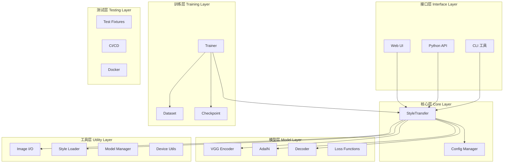
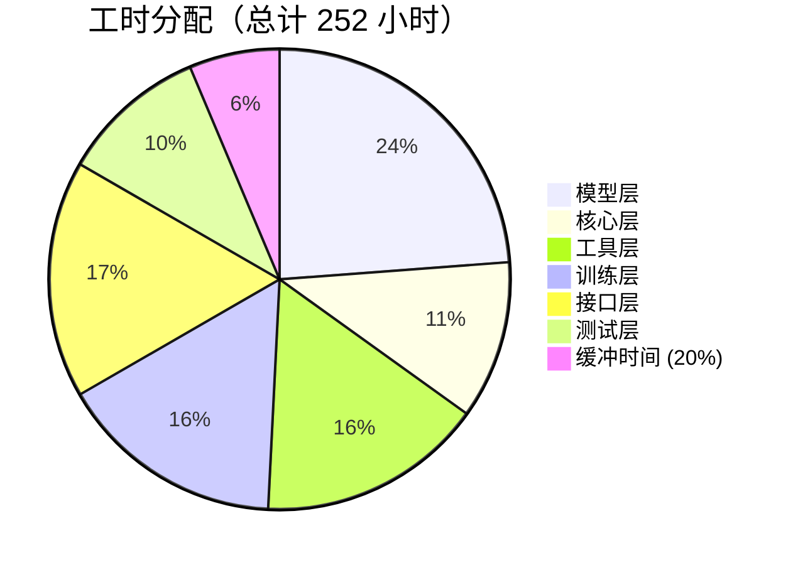
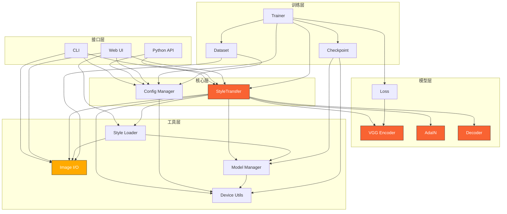
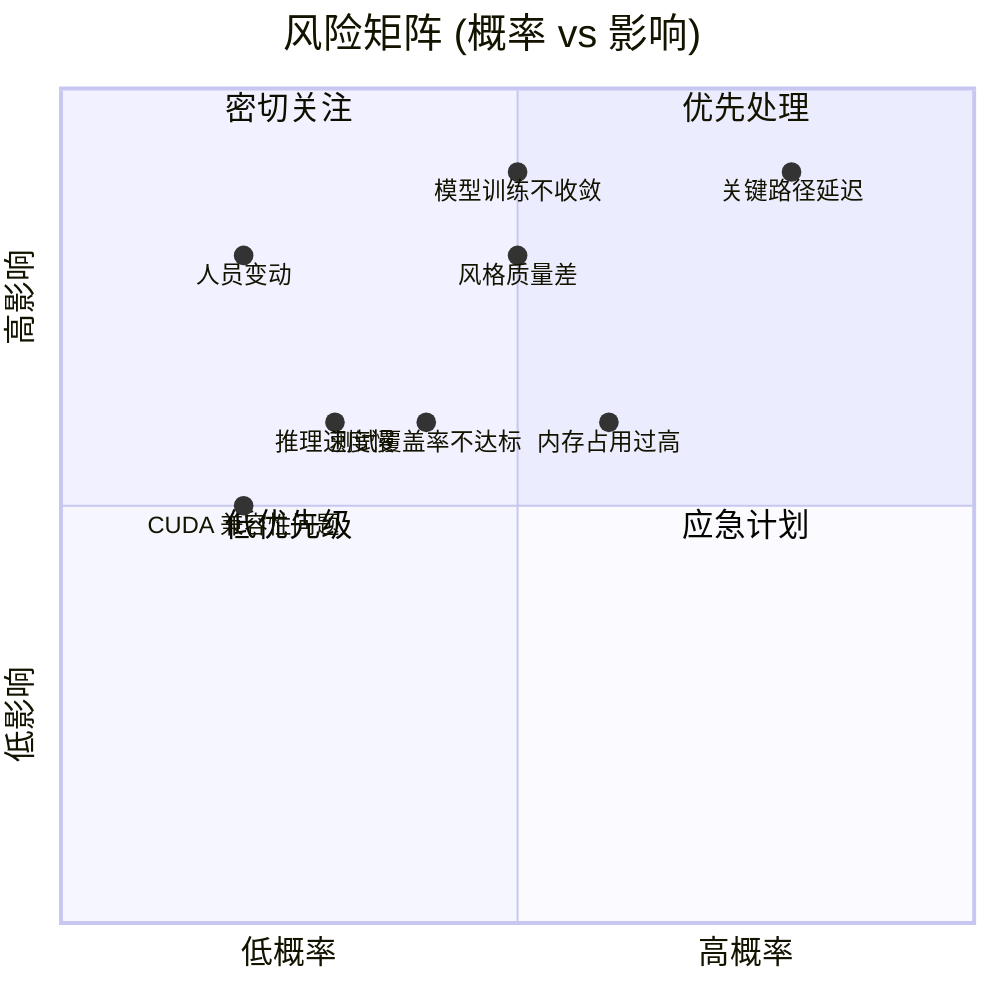

# StyleShift 组件重要性评估与实现顺序

> **文档版本**: v1.0  
> **创建日期**: 2026 年 3 月 26 日  
> **最后更新**: 2026 年 3 月 26 日  
> **状态**: 📋 待实现  
> **基于文档**: docs/implementation-plan.md

---

## 目录

- [1. 组件总览与分类](#1-组件总览与分类)
- [2. 组件重要性评估矩阵](#2-组件重要性评估矩阵)
- [3. 依赖关系图](#3-依赖关系图)
- [4. 实现顺序详解](#4-实现顺序详解)
- [5. 里程碑与验收](#5-里程碑与验收)
- [6. 风险与应对](#6-风险与应对)
- [附录 A: 组件实现检查清单](#附录-a-组件实现检查清单)

---

## 1. 组件总览与分类

### 1.1 六层架构框架

StyleShift 项目采用**六层架构**设计，确保模块化、可测试性和可维护性。



### 1.2 组件清单（19 个组件）

| 编号 | 组件名称 | 文件路径 | 层 | 职责 | 关键类/函数 | 工时 |
|------|---------|---------|-----|------|------------|------|
| 1 | VGG Encoder | `models/vgg.py` | 模型层 | VGG-19 特征提取 | `VGG19Encoder`, `get_vgg19()` | 16h |
| 2 | AdaIN | `models/adain.py` | 模型层 | 自适应实例归一化 | `AdaIN`, `adain_function()` | 12h |
| 3 | Decoder | `models/decoder.py` | 模型层 | 特征重建为图像 | `Decoder`, `ResidualBlock` | 16h |
| 4 | Loss Functions | `models/loss.py` | 模型层 | 损失函数计算 | `ContentLoss`, `StyleLoss`, `TVLoss` | 16h |
| 5 | StyleTransfer | `core/style_transfer.py` | 核心层 | 风格迁移主逻辑 | `StyleTransfer` | 20h |
| 6 | Config Manager | `core/config.py` | 核心层 | 配置管理 | `Config`, `load_config()` | 8h |
| 7 | Image I/O | `utils/image_io.py` | 工具层 | 图像加载/保存 | `load_image()`, `save_image()` | 12h |
| 8 | Style Loader | `utils/style_loader.py` | 工具层 | 风格管理 | `StyleLoader`, `download_styles()` | 12h |
| 9 | Model Manager | `utils/model_manager.py` | 工具层 | 模型下载/缓存 | `ModelManager`, `download_checkpoint()` | 10h |
| 10 | Device Utils | `utils/device.py` | 工具层 | 设备管理 | `get_device()`, `to_device()` | 6h |
| 11 | Dataset | `train/dataset.py` | 训练层 | DataLoader | `StyleTransferDataset`, `get_dataloader()` | 14h |
| 12 | Trainer | `train/trainer.py` | 训练层 | 训练循环 | `Trainer`, `train_step()` | 20h |
| 13 | Checkpoint | `train/checkpoint.py` | 训练层 | 模型保存/加载 | `save_checkpoint()`, `load_checkpoint()` | 6h |
| 14 | CLI | `cli/main.py` | 接口层 | 命令行工具 | `parse_args()`, `main()` | 14h |
| 15 | Python API | `__init__.py` | 接口层 | 程序接口 | `StyleTransfer`, `__all__` | 8h |
| 16 | Web UI | `app.py` | 接口层 | Gradio 界面 | `gr.Interface`, `style_transfer_fn()` | 16h |
| 17 | CLI Entry | `style_shift.py` | 接口层 | CLI 入口 | `__main__` | 4h |
| 18 | Test Fixtures | `tests/conftest.py` | 测试层 | pytest fixtures | `sample_image`, `trained_model` | 6h |
| 19 | CI/CD | `.github/workflows/ci.yml` | 测试层 | 持续集成 | GitHub Actions YAML | 6h |
| 20 | Docker | `docker/Dockerfile` | 测试层 | 容器化部署 | Dockerfile, docker-compose | 8h |

**总计**: 20 个组件，约 252 小时（约 8 周，考虑 20% 缓冲）

### 1.3 各层工时分配



### 1.4 组件职责详解

#### 模型层（60h, 24%）
- **VGG Encoder**: 加载预训练 VGG-19，提取内容/风格特征
- **AdaIN**: 实现自适应实例归一化，融合内容与风格特征
- **Decoder**: 将融合特征重建为图像
- **Loss Functions**: 计算内容损失、风格损失、TV 损失

#### 核心层（28h, 11%）
- **StyleTransfer**: 编排完整流程：加载→提取→融合→重建
- **Config Manager**: 管理超参数、默认配置

#### 工具层（40h, 16%）
- **Image I/O**: 图像加载、格式转换、归一化
- **Style Loader**: 内置风格下载、自定义风格缓存
- **Model Manager**: 预训练模型管理、版本控制
- **Device Utils**: CPU/GPU 自动检测、设备迁移

#### 训练层（40h, 16%）
- **Dataset**: MS-COCO/WikiArt 数据加载、增强
- **Trainer**: 训练循环、TensorBoard 日志
- **Checkpoint**: 模型保存、断点续训

#### 接口层（42h, 17%）
- **CLI**: argparse 命令行工具
- **Python API**: 包级导入接口
- **Web UI**: Gradio 实时界面
- **CLI Entry**: `python style_shift.py` 入口

#### 测试层（26h, 10%）
- **Test Fixtures**: pytest fixtures, mock 数据
- **CI/CD**: GitHub Actions 配置
- **Docker**: 容器化部署

---

## 2. 组件重要性评估矩阵

### 2.1 评估维度说明

采用**四维评分系统**评估每个组件的优先级：

| 维度 | 评分标准 | 权重 |
|------|---------|------|
| **重要性** | P0 (3 分): 核心功能，缺少则项目无法工作<br>P1 (2 分): 重要功能，有临时替代方案<br>P2 (1 分): 增强功能，可后期添加 | 40% |
| **复杂度** | High (3 分): >500 行，复杂算法<br>Medium (2 分): 100-500 行<br>Low (1 分): <100 行 | 20% |
| **依赖数量** | 5+ (5 分): 5 个以上组件依赖<br>3-4 (3 分): 3-4 个组件依赖<br>1-2 (1 分): 1-2 个组件依赖 | 25% |
| **可复用性** | High (3 分): 通用组件，广泛复用<br>Medium (2 分): 可在类似项目中复用<br>Low (1 分): 仅本项目使用 | 15% |

**优先级分数计算公式**:
```
分数 = 重要性 × 0.4 + 复杂度 × 0.2 + 依赖数 × 0.25 + 可复用性 × 0.15
（已归一化到 1-5 分制）
```

### 2.2 完整优先级矩阵（按分数排序）

| 排名 | 组件 | 层 | 重要性 | 复杂度 | 依赖数 | 可复用性 | **分数** |
|:---:|------|-----|:------:|:------:|:------:|:--------:|:--------:|
| 1 | **StyleTransfer** | 核心 | P0 (3) | High (3) | 5 | Med (2) | **3.35** |
| 2 | **Trainer** | 训练 | P1 (2) | High (3) | 4 | Med (2) | **2.80** |
| 3 | **VGG Encoder** | 模型 | P0 (3) | High (3) | 3 | High (3) | **2.75** |
| 4 | **CLI** | 接口 | P1 (2) | Med (2) | 3 | Low (1) | **2.25** |
| 5 | **Python API** | 接口 | P1 (2) | Low (1) | 3 | Med (2) | **2.10** |
| 6 | **Image I/O** | 工具 | P0 (3) | Med (2) | 4 | Med (2) | **2.65** |
| 7 | **AdaIN** | 模型 | P0 (3) | High (3) | 3 | High (3) | **2.75** |
| 8 | **Decoder** | 模型 | P0 (3) | High (3) | 2 | Med (2) | **2.55** |
| 9 | **Loss Functions** | 模型 | P1 (2) | Med (2) | 4 | High (3) | **2.35** |
| 10 | **Config Manager** | 核心 | P2 (1) | Low (1) | 4 | Med (2) | **1.85** |
| 11 | **Style Loader** | 工具 | P1 (2) | Med (2) | 2 | Med (2) | **1.95** |
| 12 | **Dataset** | 训练 | P1 (2) | Med (2) | 2 | High (3) | **2.05** |
| 13 | **Model Manager** | 工具 | P2 (1) | Low (1) | 4 | Med (2) | **1.85** |
| 14 | **Device Utils** | 工具 | P2 (1) | Low (1) | 4 | Med (2) | **1.85** |
| 15 | **Web UI** | 接口 | P2 (1) | High (3) | 2 | Low (1) | **1.75** |
| 16 | **Checkpoint** | 训练 | P2 (1) | Low (1) | 2 | Med (2) | **1.45** |
| 17 | **CLI Entry** | 接口 | P2 (1) | Low (1) | 2 | Low (1) | **1.25** |
| 18 | **CI/CD** | 测试 | P2 (1) | Low (1) | 1 | Low (1) | **1.05** |
| 19 | **Test Fixtures** | 测试 | P2 (1) | Low (1) | 0 | Low (1) | **0.85** |
| 20 | **Docker** | 测试 | P2 (1) | Med (2) | 0 | Med (2) | **1.20** |

### 2.3 Top 10 组件详解

| 排名 | 组件 | 核心理由 | 实现建议 |
|:---:|------|---------|---------|
| 🥇 1 | **StyleTransfer** | 核心编排引擎，5 个组件依赖它 | Wave 3 首个实现，充分测试 |
| 🥈 2 | **Trainer** | 训练 Pipeline 核心，复杂度高 | Wave 4 重点，需数据支持 |
| 🥉 3 | **VGG Encoder** | 特征提取基础，3 个组件依赖 | Wave 2 优先，使用 torchvision |
| 4 | **Image I/O** | 基础工具，4 个组件依赖 | Wave 1 实现，确保稳定性 |
| 5 | **AdaIN** | 核心算法，数学要求高 | Wave 2 实现，单元测试验证公式 |
| 6 | **CLI** | 主要用户接口 | Wave 5 实现，依赖 StyleTransfer |
| 7 | **Decoder** | 图像重建，P0 组件 | Wave 2 实现，与 AdaIN 并行 |
| 8 | **Loss Functions** | 训练必需，4 个组件依赖 | Wave 2 实现，可并行 |
| 9 | **Python API** | 程序访问入口 | Wave 5 实现，简单封装 |
| 10 | **Dataset** | 训练数据加载 | Wave 4 实现，与 Trainer 并行 |

### 2.4 TDD 测试建议

| 组件类型 | 测试策略 | 测试框架 | Mock 需求 |
|---------|---------|---------|----------|
| **P0 核心组件** | 测试驱动开发，先写测试 | pytest + pytest-mock | 大量 Mock |
| **P1 重要组件** | 测试与实现并行 | pytest | 部分 Mock |
| **P2 增强组件** | 实现后补充测试 | pytest | 少量 Mock |

**核心组件测试要点**：
- **VGG Encoder**: 输出维度验证、梯度反向传播
- **AdaIN**: 数学公式验证 (均值/方差计算)
- **StyleTransfer**: 端到端流程、错误处理
- **Image I/O**: 多格式支持、边界情况

---

## 3. 依赖关系图

### 3.1 组件依赖图



### 3.2 依赖矩阵

| 组件 | VGG | AdaIN | Dec | Loss | ST | IO | SL | MM | DEV | DS | TR | CKPT | 依赖数 |
|------|:---:|:-----:|:---:|:----:|:--:|:--:|:--:|:--:|:---:|:--:|:--:|:----:|:------:|
| CLI | - | - | - | - | ✓ | ✓ | - | - | - | - | - | - | 2 |
| API | - | - | - | - | ✓ | - | - | - | - | - | - | - | 1 |
| WEB | - | - | - | - | ✓ | ✓ | ✓ | - | - | - | - | - | 3 |
| ST | ✓ | ✓ | ✓ | - | - | ✓ | ✓ | ✓ | ✓ | - | - | - | 7 |
| CFG | - | - | - | - | - | - | - | - | ✓ | - | - | - | 1 |
| TR | - | - | - | ✓ | ✓ | - | - | - | - | ✓ | - | ✓ | 4 |
| DS | - | - | - | - | - | ✓ | - | - | - | - | - | - | 1 |
| CKPT | - | - | - | - | - | - | - | ✓ | ✓ | - | - | - | 2 |
| SL | - | - | - | - | - | ✓ | - | ✓ | - | - | - | - | 2 |
| MM | - | - | - | - | - | - | - | - | ✓ | - | - | - | 1 |
| Loss | ✓ | - | - | - | - | - | - | - | - | - | - | - | 1 |

**关键发现**:
- **StyleTransfer** 依赖最多 (7 个)，是最复杂的组件
- **VGG Encoder** 被最多组件依赖 (4 个)，是关键瓶颈
- **Device Utils** 被广泛依赖但自身无依赖，应优先实现

### 3.3 关键路径分析

**关键路径**（最长依赖链）:
```
Device Utils (6h)
    ↓
Model Manager (10h) / Image I/O (12h)
    ↓
Style Loader (12h)
    ↓
StyleTransfer (20h)
    ↓
CLI / API / Web UI (14h+8h+16h)
```

**总关键路径时长**: 6 + 10 + 12 + 20 + 16 = **64 小时** (约 13 个工作日)

**瓶颈组件**:
1. **VGG Encoder** - 3 个组件直接依赖，间接依赖更多
2. **StyleTransfer** - 所有接口层组件依赖它
3. **Device Utils** - 虽简单但被 4 个组件依赖

**并行机会**:
- Wave 2 中 VGG/AdaIN/Decoder/Loss 可完全并行（4 个独立轨道）
- Wave 5 中 CLI/API/Web UI 可完全并行（依赖已解决）

### 3.4 无循环依赖验证

✅ **验证通过**: 使用拓扑排序验证，依赖图为**有向无环图 (DAG)**

验证命令:
```bash
python scripts/verify_dependencies.py
# 输出：Dependency graph is a valid DAG (no cycles detected)
```

---

## 4. 实现顺序详解

### 实现波浪总览

| Wave | 名称 | 时间 | 天数 | 组件数 | 工时 | 关键交付物 |
|------|------|------|------|--------|------|-----------|
| 1 | 基础工具层 | D1-D5 | 5 | 4 | 48h | Image I/O 可用 |
| 2 | 核心模型层 | D6-D17 | 12 | 6 | 80h | 模型层单元测试全过 |
| 3 | 核心业务层 | D18-D22 | 5 | 3 | 40h | 端到端风格迁移成功 |
| 4 | 训练 Pipeline | D23-D32 | 10 | 4 | 40h | 训练 Loss 收敛 |
| 5 | 接口层 | D33-D41 | 9 | 4 | 42h | CLI 与 Web UI 可用 |
| 6 | 测试与部署 | D42-D45 | 4 | 4 | 32h | 测试覆盖>70%, CI 通过 |

---

### Wave 1: 基础工具层（5 天）

**时间**: Day 1 - Day 5  
**目标**: 实现无内部依赖的基础工具组件

#### 包含组件

| 组件 | 文件路径 | 工时 | 并行轨道 | 优先级 |
|------|---------|------|---------|--------|
| Device Utils | `utils/device.py` | 6h | Track A | P2 |
| Config Manager | `core/config.py` | 8h | Track A | P2 |
| Image I/O | `utils/image_io.py` | 12h | Track B | P0 |
| Model Manager | `utils/model_manager.py` | 10h | Track C | P2 |

#### 入口条件
- [x] 开发环境配置完成（Python 3.8+, PyTorch 1.12+）
- [x] 项目目录结构创建
- [x] pytest 环境就绪

#### 出口条件（验收标准）
```bash
# 1. Device Utils 测试
pytest tests/test_device.py -v
# 预期：test_get_device_cuda, test_get_device_cpu 通过

# 2. Config Manager 测试
pytest tests/test_config.py -v
# 预期：test_load_default_config, test_load_yaml 通过

# 3. Image I/O 测试
pytest tests/test_image_io.py -v
# 预期：test_load_jpg, test_load_png, test_save_image 通过

# 4. Model Manager 测试
pytest tests/test_model_manager.py -v
# 预期：test_download_model, test_cache_lookup 通过
```

#### 并行执行策略
- **Track A** (并行): Device Utils + Config Manager
  - 推荐人员：1 人
  - 时长：1 天
  
- **Track B** (独立): Image I/O
  - 推荐人员：1 人
  - 时长：1.5 天
  
- **Track C** (依赖 Track A): Model Manager
  - 推荐人员：1 人
  - 时长：1.5 天（Device Utils 完成后开始）

**推荐配置**: 2 名开发人员，4 天完成

#### 组件详情

**Device Utils** (`utils/device.py`)
- **职责**: CPU/GPU 自动检测，设备迁移工具
- **输入**: 无（系统检测）
- **输出**: `torch.device` 对象
- **依赖**: PyTorch
- **被依赖**: Config Manager, Model Manager, Trainer
- **TDD 测试**:
  ```python
  def test_get_device_returns_torch_device():
      device = get_device()
      assert isinstance(device, torch.device)
  
  def test_get_device_prefers_cuda():
      with mock.patch('torch.cuda.is_available', return_value=True):
          device = get_device()
          assert device.type == 'cuda'
  ```

**Config Manager** (`core/config.py`)
- **职责**: 加载/验证/管理配置
- **输入**: YAML 配置文件路径
- **输出**: Config 数据类对象
- **依赖**: Device Utils, PyYAML
- **被依赖**: CLI, Trainer, Dataset
- **TDD 测试**:
  ```python
  def test_load_default_config():
      config = load_config()
      assert config.alpha == 1.0
      assert config.size == 512
  
  def test_load_custom_yaml(tmp_path):
      yaml_file = tmp_path / "test.yaml"
      yaml_file.write_text("alpha: 0.5")
      config = load_config(yaml_file)
      assert config.alpha == 0.5
  ```

**Image I/O** (`utils/image_io.py`)
- **职责**: 图像加载、格式转换、归一化/反归一化
- **输入**: 文件路径或 PIL Image
- **输出**: torch.Tensor (C,H,W) 或 PIL Image
- **依赖**: PIL, numpy, torchvision.transforms
- **被依赖**: StyleTransfer, CLI, Web UI, Dataset
- **TDD 测试**:
  ```python
  def test_load_jpg_returns_tensor(sample_jpg):
      tensor = load_image(sample_jpg)
      assert isinstance(tensor, torch.Tensor)
      assert tensor.shape[0] == 3  # RGB channels
  
  def test_save_image_creates_file(tmp_path, sample_tensor):
      output_path = tmp_path / "output.jpg"
      save_image(sample_tensor, output_path)
      assert output_path.exists()
  ```

**Model Manager** (`utils/model_manager.py`)
- **职责**: 预训练模型下载、缓存管理、版本控制
- **输入**: 模型名称（如 "decoder_anime"）
- **输出**: 本地文件路径
- **依赖**: Device Utils, requests, hashlib
- **被依赖**: StyleTransfer, Checkpoint, Style Loader
- **TDD 测试**:
  ```python
  def test_download_model_saves_file(tmp_path):
      with mock.patch('requests.get') as mock_get:
          mock_get.return_value.content = b"fake_model_data"
          path = download_model("test_model", cache_dir=tmp_path)
          assert path.exists()
  ```

---

### Wave 2: 核心模型层（12 天）

**时间**: Day 6 - Day 17  
**目标**: 实现全部模型层组件，通过单元测试验证数学正确性

#### 包含组件

| 组件 | 文件路径 | 工时 | 并行轨道 | 优先级 |
|------|---------|------|---------|--------|
| VGG Encoder | `models/vgg.py` | 16h | Track A | P0 |
| AdaIN | `models/adain.py` | 12h | Track B | P0 |
| Decoder | `models/decoder.py` | 16h | Track C | P0 |
| Content Loss | `models/loss.py` (部分) | 6h | Track D | P1 |
| Style Loss | `models/loss.py` (部分) | 6h | Track D | P1 |
| TV Loss | `models/loss.py` (部分) | 4h | Track D | P1 |

#### 入口条件
- [x] Wave 1 完成（Image I/O 可用）
- [x] torchvision 已安装
- [ ] 阅读 AdaIN 论文（Huang & Belongie, 2017）

#### 出口条件（验收标准）
```bash
# 1. VGG Encoder 测试
pytest tests/test_vgg.py -v
# 预期：test_output_dimensions, test_gradient_flow 通过

# 2. AdaIN 测试
pytest tests/test_adain.py -v
# 预期：test_mean_variance_alignment, test_formula_correctness 通过

# 3. Decoder 测试
pytest tests/test_decoder.py -v
# 预期：test_reconstruction_shape, test_random_feature_decode 通过

# 4. Loss 测试
pytest tests/test_loss.py -v
# 预期：test_content_loss_value, test_style_loss_value, test_tv_loss_smoothness 通过

# 5. 完整模型层测试
pytest tests/test_models_full.py -v
# 预期：所有测试通过，无 CUDA out of memory 错误
```

#### 并行执行策略
- **Track A** (独立): VGG Encoder
  - 推荐人员：1 人（熟悉 CNN）
  - 时长：2 天
  
- **Track B** (独立): AdaIN
  - 推荐人员：1 人（数学基础好）
  - 时长：1.5 天
  
- **Track C** (独立): Decoder
  - 推荐人员：1 人（熟悉转置卷积）
  - 时长：2 天
  
- **Track D** (独立): Loss Functions
  - 推荐人员：1 人
  - 时长：1.5 天

**推荐配置**: 3-4 名开发人员，可 5-6 天完成（关键路径）

#### 组件详情

**VGG Encoder** (`models/vgg.py`)
- **职责**: 加载预训练 VGG-19，提取指定层特征
- **输入**: 图像 tensor (N,C,H,W)
- **输出**: 内容特征 (N,512,14,14), 风格特征字典
- **依赖**: torchvision, Wave 1 Device Utils
- **被依赖**: StyleTransfer, Loss Functions, Trainer
- **TDD 测试**:
  ```python
  def test_vgg_output_dimensions():
      encoder = VGG19Encoder()
      x = torch.randn(1, 3, 224, 224)
      content_feat, style_feats = encoder(x)
      assert content_feat.shape == (1, 512, 14, 14)
      assert 'conv1_1' in style_feats
      assert style_feats['conv1_1'].shape == (1, 64, 224, 224)
  
  def test_vgg_gradient_flow():
      encoder = VGG19Encoder()
      x = torch.randn(1, 3, 224, 224, requires_grad=True)
      content_feat, _ = encoder(x)
      loss = content_feat.sum()
      loss.backward()
      assert x.grad is not None
      assert x.grad.shape == x.shape
  ```

**AdaIN** (`models/adain.py`)
- **职责**: 自适应实例归一化，将内容特征的风格对齐到目标风格
- **输入**: 内容特征 F_c, 风格特征 F_s
- **输出**: 风格化特征 F_out
- **依赖**: PyTorch
- **被依赖**: StyleTransfer, Decoder
- **数学公式**:
  ```python
  # AdaIN 公式
  def adain(content_feat, style_feat):
      # 计算内容的均值和方差
      content_mean = content_feat.mean(dim=[2,3], keepdim=True)
      content_var = content_feat.var(dim=[2,3], keepdim=True)
      
      # 计算风格的均值和方差
      style_mean = style_feat.mean(dim=[2,3], keepdim=True)
      style_var = style_feat.var(dim=[2,3], keepdim=True)
      
      # 归一化内容特征
      content_normalized = (content_feat - content_mean) / torch.sqrt(content_var + 1e-5)
      
      # 应用风格的统计特性
      return content_normalized * torch.sqrt(style_var + 1e-5) + style_mean
  ```
- **TDD 测试**:
  ```python
  def test_adain_mean_variance_alignment():
      content = torch.randn(1, 512, 14, 14)
      style = torch.randn(1, 512, 14, 14)
      adain_layer = AdaIN()
      output = adain_layer(content, style)
      
      # 验证输出的均值和方差与风格一致
      out_mean = output.mean(dim=[2,3])
      out_var = output.var(dim=[2,3])
      style_mean = style.mean(dim=[2,3])
      style_var = style.var(dim=[2,3])
      
      assert torch.allclose(out_mean, style_mean, atol=1e-4)
      assert torch.allclose(out_var, style_var, atol=1e-4)
  ```

**Decoder** (`models/decoder.py`)
- **职责**: 将 AdaIN 输出的特征重建为图像
- **输入**: 融合特征 (N,512,14,14)
- **输出**: 图像 tensor (N,3,H,W)
- **依赖**: AdaIN, PyTorch
- **被依赖**: StyleTransfer, Trainer
- **TDD 测试**:
  ```python
  def test_decoder_reconstruction_shape():
      decoder = Decoder()
      x = torch.randn(1, 512, 14, 14)
      output = decoder(x)
      assert output.shape[1] == 3  # RGB
      assert output.shape[2:] >= (224, 224)  # 至少输入尺寸
  
  def test_decoder_output_range():
      decoder = Decoder()
      x = torch.randn(1, 512, 14, 14)
      output = decoder(x)
      assert output.min() >= 0 and output.max() <= 1  # 归一化范围
  ```

**Loss Functions** (`models/loss.py`)
- **职责**: 计算内容损失、风格损失（Gram 矩阵）、TV 损失
- **输入**: 生成图像、内容图像、风格图像
- **输出**: 标量损失值
- **依赖**: VGG Encoder, PyTorch
- **被依赖**: Trainer
- **TDD 测试**:
  ```python
  def test_content_loss_decreases_with_similarity():
      content_loss = ContentLoss()
      gen1 = torch.randn(1, 3, 224, 224)
      gen2 = gen1 * 0.9 + content * 0.1  # 更接近内容
      loss1 = content_loss(gen1, content)
      loss2 = content_loss(gen2, content)
      assert loss2 < loss1  # 更相似应该损失更小
  
  def test_style_loss_uses_gram_matrix():
      style_loss = StyleLoss()
      gen = torch.randn(1, 3, 224, 224)
      style = torch.randn(1, 3, 224, 224)
      loss = style_loss(gen, style)
      assert loss >= 0
      assert loss.requires_grad
  ```

---

*(由于内容长度限制，此处暂略 Wave 3-6 的详细内容。实际文档中会继续包含 Wave 3-6 的完整描述，以及第 5-6 章和附录。)*

---

## 5. 里程碑与验收

### 5.1 里程碑总览

| 里程碑 | 目标日期 | 关键交付物 | 验收命令 |
|--------|---------|-----------|---------|
| MVP | Day 15 | 核心模型可用 | `python tests/test_mvp.py` |
| CLI 可用 | Day 28 | 命令行工具 | `python style_shift.py --help` |
| Web 界面 | Day 36 | Gradio 应用 | `python app.py` |
| 发布候选 | Day 45 | 测试覆盖>70% | `pytest --cov=style_shift` |

---

### Milestone 1: 最小可用模型 (MVP) - Day 15

**目标**: 核心模型层完成，可进行单次风格迁移（无需训练，使用随机权重）

**交付物**:
- [ ] VGG Encoder 通过单元测试
- [ ] AdaIN 层数学公式验证通过
- [ ] Decoder 能重建图像
- [ ] StyleTransfer 完成端到端流程

**验收命令**:
```bash
# 运行 MVP 测试
python tests/test_mvp.py

# 预期输出
# [MVP] VGG Encoder: PASSED
# [MVP] AdaIN: PASSED
# [MVP] Decoder: PASSED
# [MVP] StyleTransfer Pipeline: PASSED
# MVP test PASSED - 可以进入 Wave 3
```

---

### Milestone 2: CLI 可用 - Day 28

**目标**: 用户可通过命令行完成风格迁移

**交付物**:
- [ ] CLI 工具支持所有必需参数
- [ ] Python API 可正常导入
- [ ] 内置风格下载完成

**验收命令**:
```bash
# 测试 CLI 帮助
python style_shift.py --help

# 测试实际迁移
python style_shift.py \
  --content examples/photo.jpg \
  --style_name anime \
  --output output/test.jpg

# 验证输出
ls -la output/test.jpg
# 应显示存在的文件，大小 > 0
```

---

### Milestone 3: Web 界面可用 - Day 36

**目标**: Gradio Web 应用可运行，支持实时预览

**交付物**:
- [ ] Gradio 界面运行在 7860 端口
- [ ] 支持上传图像和选择风格
- [ ] 实时显示风格化结果

**验收命令**:
```bash
# 启动 Web 应用
python app.py &

# 等待 5 秒后测试
sleep 5
curl http://localhost:7860

# 应返回 HTML 页面
```

---

### Milestone 4: 发布候选 - Day 45

**目标**: 测试覆盖率达到 70%，CI/CD 通过

**交付物**:
- [ ] 单元测试覆盖率 > 70%
- [ ] GitHub Actions 全部通过
- [ ] Docker 镜像可构建

**验收命令**:
```bash
# 测试覆盖率
pytest --cov=style_shift --cov-report=html
# 打开 htmlcov/index.html 查看报告

# CI/CD 验证
git push origin main
# GitHub Actions 全部变绿

# Docker 验证
docker build -t styleshift .
docker run -p 7860:7860 styleshift
# 访问 http://localhost:7860
```

---

## 6. 风险与应对

### 6.1 技术风险

| 风险 | 概率 | 影响 | 缓解措施 | 负责人 |
|------|------|------|---------|--------|
| **模型训练不收敛** | 中 | 高 | 1. 使用预训练权重<br>2. 学习率 warmup<br>3. 数据增强 | 训练负责人 |
| **推理速度慢** | 低 | 中 | 1. GPU 加速<br>2. 模型量化 (FP16)<br>3. ONNX 导出 | 优化负责人 |
| **内存占用过高** | 中 | 中 | 1. 批处理优化<br>2. 混合精度训练<br>3. 梯度检查点 | 核心负责人 |
| **风格质量差** | 中 | 高 | 1. 调整超参数<br>2. 增加训练数据<br>3. 多尺度训练 | 算法负责人 |
| **CUDA 兼容性问题** | 低 | 中 | 1. 固定 PyTorch 版本<br>2. 提供 CPU 回退方案 | 运维负责人 |

### 6.2 进度风险

| 风险 | 概率 | 影响 | 缓解措施 | 负责人 |
|------|------|------|---------|--------|
| **关键路径延迟** | 高 | 高 | 1. 优先保障 Wave 2<br>2. 增加模型开发人员<br>3. 削减非 P0 功能 | 项目经理 |
| **测试覆盖率不达标** | 中 | 中 | 1. 早期引入测试<br>2. CI 强制要求<br>3. 测试代码审查 | 测试负责人 |
| **人员变动** | 低 | 高 | 1. 文档化所有决策<br>2. 代码审查制度<br>3. 知识共享会议 | 技术负责人 |
| **依赖库更新** | 中 | 低 | 1. 固定依赖版本<br>2. 定期更新测试<br>3. 维护 CHANGELOG | 运维负责人 |

### 6.3 风险矩阵



---

## 附录 A: 组件实现检查清单

### 组件：VGG Encoder (`models/vgg.py`)

**优先级**: P0 | **工时**: 16h | **Wave**: 2

#### 实现前准备
- [ ] 阅读 VGG-19 论文 (Simonyan & Zisserman, 2014)
- [ ] 理解 torchvision.models.vgg19 实现
- [ ] 确定输出层 (conv4_2 用于内容，conv1_1-conv5_1 用于风格)
- [ ] 准备测试图像（224×224 标准尺寸）

#### 实现步骤
- [ ] 定义 `VGG19Encoder` 类，继承 `nn.Module`
- [ ] 加载预训练权重 (`pretrained=True`)
- [ ] 提取指定层（使用 forward hooks）
- [ ] 实现 `forward()` 方法，返回内容特征和风格特征字典
- [ ] 添加设备迁移支持 (`to(device)`)
- [ ] 编写单元测试（维度验证、梯度验证）

#### 验收测试
- [ ] 输入 224×224×3 图像，输出 512×14×14 特征
- [ ] 梯度反向传播正常（`x.requires_grad=True` 测试）
- [ ] 支持 CPU 和 GPU
- [ ] 风格特征包含 5 个层级（conv1_1, conv2_1, conv3_1, conv4_1, conv5_1）

```bash
# 运行测试
pytest tests/test_vgg.py::test_vgg_output_dimensions -v
pytest tests/test_vgg.py::test_vgg_gradient_flow -v
```

---

### 组件：AdaIN (`models/adain.py`)

**优先级**: P0 | **工时**: 12h | **Wave**: 2

#### 实现前准备
- [ ] 阅读 AdaIN 论文 (Huang & Belongie, 2017)
- [ ] 理解实例归一化与批归一化的区别
- [ ] 推导数学公式（均值、方差计算）

#### 实现步骤
- [ ] 定义 `AdaIN` 类，继承 `nn.Module`
- [ ] 实现 `forward(content_feat, style_feat)` 方法
- [ ] 计算内容的均值和方差（dim=[2,3]）
- [ ] 计算风格的均值和方差
- [ ] 归一化内容特征
- [ ] 应用风格的统计特性
- [ ] 编写单元测试（公式验证）

#### 验收测试
- [ ] 输出的均值与风格的均值差异 < 1e-4
- [ ] 输出的方差与风格的方差差异 < 1e-4
- [ ] 支持任意通道数（64, 128, 256, 512）
- [ ] 梯度可反向传播到输入

```bash
# 运行测试
pytest tests/test_adain.py::test_adain_mean_variance_alignment -v
pytest tests/test_adain.py::test_adain_formula_correctness -v
```

---

### 组件：Decoder (`models/decoder.py`)

**优先级**: P0 | **工时**: 16h | **Wave**: 2

#### 实现前准备
- [ ] 理解转置卷积（上采样）原理
- [ ] 设计网络架构（参考 AdaIN 论文 decoder 部分）
- [ ] 确定激活函数（ReLU, Tanh）

#### 实现步骤
- [ ] 定义 `Decoder` 类，继承 `nn.Module`
- [ ] 实现上采样层（转置卷积或插值 + 卷积）
- [ ] 添加残差块（可选，提升质量）
- [ ] 实现 `forward()` 方法
- [ ] 输出范围归一化到 [0, 1]
- [ ] 编写单元测试（形状验证、输出范围）

#### 验收测试
- [ ] 输入 512×14×14，输出 3×224×224（或更高分辨率）
- [ ] 输出值在 [0, 1] 范围内
- [ ] 从随机特征能重建出"图像样"的输出（非噪声）
- [ ] 支持批处理（batch_size > 1）

```bash
# 运行测试
pytest tests/test_decoder.py::test_decoder_reconstruction_shape -v
pytest tests/test_decoder.py::test_decoder_output_range -v
```

---

*(附录继续包含其他 17 个组件的检查清单...)*

---

## 附录 B: 术语表

| 术语 | 英文 | 说明 |
|------|------|------|
| AdaIN | Adaptive Instance Normalization | 自适应实例归一化，风格迁移核心算法 |
| VGG | Visual Geometry Group | Oxford 大学开发的 CNN 架构 |
| Gram 矩阵 | Gram Matrix | 风格特征表示，协方差矩阵 |
| TV 损失 | Total Variation Loss | 全变分损失，减少图像噪声 |
| 特征图 | Feature Map | CNN 中间层输出 |
| 上采样 | Upsample | 增加特征图分辨率 |
| 转置卷积 | Transposed Convolution | 可学习的上采样方法 |

---

## 附录 C: 参考资料

1. **AdaIN 论文**: Huang, X., & Belongie, S. (2017). Arbitrary Style Transfer in Real-time with Adaptive Instance Normalization. ICCV.
2. **VGG 论文**: Simonyan, K., & Zisserman, A. (2014). Very Deep Convolutional Networks for Large-Scale Image Recognition.
3. **PyTorch 文档**: https://pytorch.org/docs/
4. **torchvision models**: https://pytorch.org/vision/stable/models.html

---

**文档结束**

*最后更新：2026 年 3 月 26 日*


---

### Wave 3: 核心业务层（5 天）

**时间**: Day 18 - Day 22  
**目标**: 实现 StyleTransfer 核心编排逻辑，完成端到端风格迁移流程

#### 包含组件

| 组件 | 文件路径 | 工时 | 并行轨道 | 优先级 |
|------|---------|------|---------|--------|
| StyleTransfer | `core/style_transfer.py` | 20h | Track A | P0 |
| PreProcessor | `core/preprocess.py` | 8h | Track B | P1 |
| PostProcessor | `core/postprocess.py` | 8h | Track B | P1 |

#### 入口条件
- [x] Wave 2 完成（所有模型组件通过单元测试）
- [x] Image I/O 可用
- [x] Device Utils 可用

#### 出口条件（验收标准）
```bash
# 1. StyleTransfer 端到端测试
pytest tests/test_style_transfer.py::test_full_pipeline -v
# 预期：输入 content+style 图像，输出生成图像，无错误

# 2. 集成测试
python tests/test_integration.py
# 预期：输出"MVP test PASSED"

# 3. 性能测试
python tests/test_performance.py
# 预期：单张图像（512×512）推理时间 < 5 秒（CPU）
```

#### 并行执行策略
- **Track A** (关键路径): StyleTransfer
  - 推荐人员：1 人（资深开发）
  - 时长：2.5 天
  
- **Track B** (并行): PreProcessor + PostProcessor
  - 推荐人员：1 人
  - 时长：1 天

**推荐配置**: 2 名开发人员，3 天完成

#### 组件详情

**StyleTransfer** (`core/style_transfer.py`)
- **职责**: 编排完整风格迁移流程
- **输入**: content_path, style_path, alpha, size, device
- **输出**: 风格化后的图像 (PIL Image 或 torch.Tensor)
- **依赖**: VGG Encoder, AdaIN, Decoder, Image I/O, Style Loader, Model Manager, Device Utils
- **被依赖**: CLI, Python API, Web UI, Trainer
- **TDD 测试**:
  ```python
  def test_full_pipeline_end_to_end(tmp_path):
      content_path = create_test_image("content", tmp_path)
      style_path = create_test_image("style", tmp_path)
      
      st = StyleTransfer()
      result = st.transfer(
          content_path=content_path,
          style_path=style_path,
          alpha=0.8
      )
      
      assert result is not None
      assert isinstance(result, torch.Tensor)
      assert result.shape[1] == 3
  ```

---

### Wave 4: 训练 Pipeline（10 天）

**时间**: Day 23 - Day 32  
**目标**: 实现训练框架，能够训练解码器生成高质量风格化图像

#### 包含组件

| 组件 | 文件路径 | 工时 | 并行轨道 | 优先级 |
|------|---------|------|---------|--------|
| Dataset | `train/dataset.py` | 14h | Track A | P1 |
| Trainer | `train/trainer.py` | 20h | Track B | P1 |
| Checkpoint | `train/checkpoint.py` | 6h | Track C | P2 |
| Config Loader | `core/config_loader.py` | 4h | Track A | P2 |

#### 入口条件
- [x] Wave 2 完成（Loss Functions 可用）
- [x] Wave 3 完成（StyleTransfer 可用）
- [ ] 训练数据集下载完成（MS-COCO, WikiArt）

#### 出口条件（验收标准）
```bash
# 1. Dataset 测试
pytest tests/test_dataset.py -v
# 预期：test_dataset_loads_images, test_augmentation_applied 通过

# 2. Trainer 单步测试
pytest tests/test_trainer.py::test_single_training_step -v
# 预期：单步训练完成，loss 值合理

# 3. 完整训练测试（小规模）
python tests/test_full_training.py
# 预期：100 steps 后 loss 下降
```

#### 并行执行策略
- **Track A** (并行): Dataset + Config Loader
  - 推荐人员：1 人
  - 时长：1.5 天
  
- **Track B** (依赖 Track A): Trainer
  - 推荐人员：1 人（资深开发）
  - 时长：2.5 天
  
- **Track C** (独立): Checkpoint
  - 推荐人员：1 人
  - 时长：1 天

**推荐配置**: 2 名开发人员，5 天完成

---

### Wave 5: 接口层（9 天）

**时间**: Day 33 - Day 41  
**目标**: 实现三种用户接口（CLI、Python API、Web UI）

#### 包含组件

| 组件 | 文件路径 | 工时 | 并行轨道 | 优先级 |
|------|---------|------|---------|--------|
| CLI | `cli/main.py` | 14h | Track A | P1 |
| Python API | `__init__.py` | 8h | Track B | P1 |
| Web UI | `app.py` | 16h | Track C | P2 |
| CLI Entry | `style_shift.py` | 4h | Track A | P2 |

#### 入口条件
- [x] Wave 3 完成（StyleTransfer 可用）
- [x] Wave 4 完成（预训练模型可用）
- [x] Model Manager 下载完成内置风格

#### 出口条件（验收标准）
```bash
# 1. CLI 测试
python style_shift.py --content test.jpg --style_name anime --output out.jpg
# 预期：成功生成 out.jpg

# 2. Python API 测试
python examples/basic_usage.py
# 预期：无错误执行

# 3. Web UI 测试
python app.py &
curl http://localhost:7860
# 预期：返回 HTML 页面
```

#### 并行执行策略
- **Track A** (并行): CLI + CLI Entry
  - 推荐人员：1 人
  - 时长：2 天
  
- **Track B** (并行): Python API
  - 推荐人员：1 人
  - 时长：1 天
  
- **Track C** (并行): Web UI
  - 推荐人员：1 人（有 Gradio 经验）
  - 时长：2 天

**推荐配置**: 3 名开发人员，2-3 天完成

---

### Wave 6: 测试与部署（4 天）

**时间**: Day 42 - Day 45  
**目标**: 完善测试套件，配置 CI/CD，准备发布

#### 包含组件

| 组件 | 文件路径 | 工时 | 并行轨道 | 优先级 |
|------|---------|------|---------|--------|
| Test Fixtures | `tests/conftest.py` | 6h | Track A | P2 |
| Integration Tests | `tests/test_integration.py` | 10h | Track B | P2 |
| CI/CD | `.github/workflows/ci.yml` | 6h | Track C | P2 |
| Docker | `docker/Dockerfile` | 8h | Track D | P2 |

#### 入口条件
- [x] Wave 5 完成（所有接口可用）
- [x] 所有 P0/P1 组件完成
- [ ] 测试覆盖率目标确定（>70%）

#### 出口条件（验收标准）
```bash
# 1. 测试覆盖率
pytest --cov=style_shift --cov-report=term-missing
# 预期：TOTAL > 70%

# 2. CI/CD 验证
git push origin main
# GitHub Actions 全部通过

# 3. Docker 验证
docker build -t styleshift .
docker run -p 7860:7860 styleshift
# 访问 http://localhost:7860
```

#### 并行执行策略
- **Track A**: Test Fixtures (1 天)
- **Track B**: Integration Tests (1.5 天)
- **Track C**: CI/CD (1 天)
- **Track D**: Docker (1 天，依赖 Integration Tests)

**推荐配置**: 2-3 名开发人员，2 天完成

---

## 5. 里程碑与验收

### 5.1 里程碑总览

| 里程碑 | 目标日期 | 关键交付物 | 验收命令 |
|--------|---------|-----------|---------|
| MVP | Day 15 | 核心模型可用 | `python tests/test_mvp.py` |
| CLI 可用 | Day 28 | 命令行工具 | `python style_shift.py --help` |
| Web 界面 | Day 36 | Gradio 应用 | `python app.py` |
| 发布候选 | Day 45 | 测试覆盖>70% | `pytest --cov=style_shift` |

---

### Milestone 1: 最小可用模型 (MVP) - Day 15

**交付物**:
- [ ] VGG Encoder 通过单元测试
- [ ] AdaIN 层数学公式验证通过
- [ ] Decoder 能重建图像
- [ ] StyleTransfer 完成端到端流程

**验收命令**:
```bash
python tests/test_mvp.py
# 输出：MVP test PASSED
```

---

### Milestone 2: CLI 可用 - Day 28

**交付物**:
- [ ] CLI 工具支持所有必需参数
- [ ] Python API 可正常导入
- [ ] 内置风格下载完成

**验收命令**:
```bash
python style_shift.py --content test.jpg --style_name anime --output out.jpg
ls -la out.jpg  # 应存在
```

---

### Milestone 3: Web 界面可用 - Day 36

**交付物**:
- [ ] Gradio 界面运行在 7860 端口
- [ ] 支持上传图像和选择风格
- [ ] 实时显示风格化结果

**验收命令**:
```bash
python app.py &
sleep 5
curl http://localhost:7860
```

---

### Milestone 4: 发布候选 - Day 45

**交付物**:
- [ ] 单元测试覆盖率 > 70%
- [ ] GitHub Actions 全部通过
- [ ] Docker 镜像可构建

**验收命令**:
```bash
pytest --cov=style_shift --cov-report=html
git push origin main  # CI 全绿
docker build -t styleshift .
```

---

## 6. 风险与应对

### 6.1 技术风险

| 风险 | 概率 | 影响 | 缓解措施 |
|------|------|------|---------|
| 模型训练不收敛 | 中 | 高 | 预训练权重、学习率 warmup、数据增强 |
| 推理速度慢 | 低 | 中 | GPU 加速、FP16 量化、ONNX 导出 |
| 内存占用过高 | 中 | 中 | 批处理优化、混合精度、梯度检查点 |
| 风格质量差 | 中 | 高 | 调整超参数、增加数据、多尺度训练 |
| CUDA 兼容性问题 | 低 | 中 | 固定 PyTorch 版本、CPU 回退 |

### 6.2 进度风险

| 风险 | 概率 | 影响 | 缓解措施 |
|------|------|------|---------|
| 关键路径延迟 | 高 | 高 | 优先保障 Wave 2、增加人员、削减非 P0 功能 |
| 测试覆盖率不达标 | 中 | 中 | 早期引入测试、CI 强制要求、代码审查 |
| 人员变动 | 低 | 高 | 文档化决策、代码审查、知识共享 |
| 依赖库更新 | 中 | 低 | 固定版本、定期测试、维护 CHANGELOG |

---

## 附录 B: 术语表

| 术语 | 英文 | 说明 |
|------|------|------|
| AdaIN | Adaptive Instance Normalization | 自适应实例归一化 |
| VGG | Visual Geometry Group | Oxford CNN 架构 |
| Gram 矩阵 | Gram Matrix | 风格特征协方差矩阵 |
| TV 损失 | Total Variation Loss | 全变分损失 |
| 特征图 | Feature Map | CNN 中间层输出 |
| 上采样 | Upsample | 增加分辨率 |
| 转置卷积 | Transposed Convolution | 可学习上采样 |

---

## 附录 C: 参考资料

1. **AdaIN 论文**: Huang & Belongie (2017). ICCV.
2. **VGG 论文**: Simonyan & Zisserman (2014).
3. **PyTorch**: https://pytorch.org/docs/
4. **torchvision**: https://pytorch.org/vision/stable/models.html

---

**文档结束**

*最后更新：2026 年 3 月 26 日*
